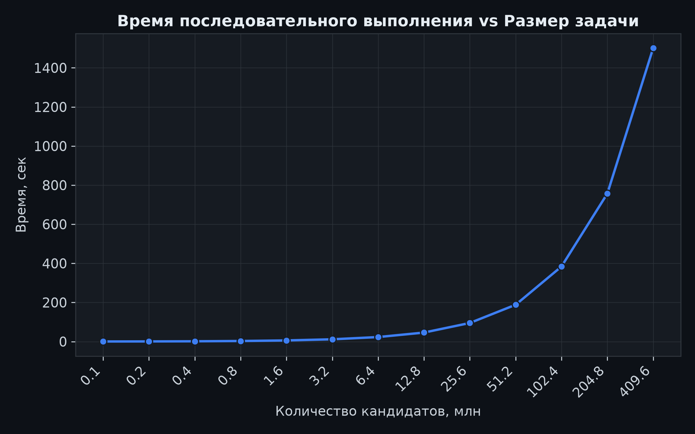
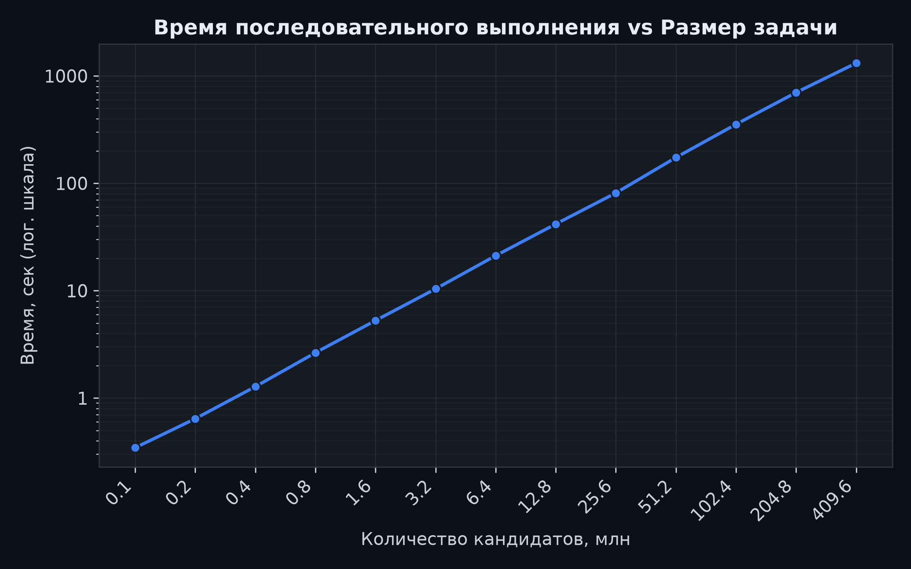
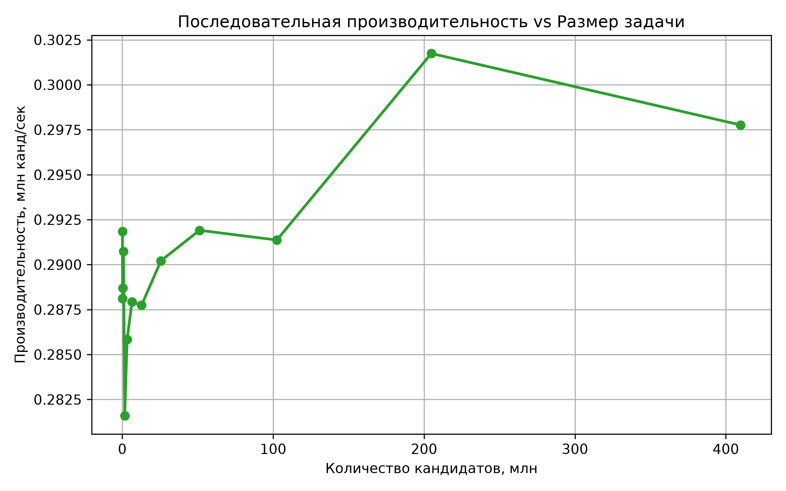

# Лабораторная работа 1 — последовательная версия

Общая суть задачи, архитектура и методика эксперимента — в [корневом README](../../README.md).

## 1. Цель работы

Реализовать и измерить **однопоточную** версию аудита паролей, проверить её корректность на 13 размерах задачи (100 тыс. — 409,6 млн кандидатов) и получить базовые показатели производительности.

## 2. Алгоритм

Единственный поток обходит весь диапазон `[range_begin, range_end)` подряд:

```cpp
counter ← CandidateCounter(charset, length, range_begin)
stopwatch.start()
for index in [range_begin, range_end):
    password ← counter.password()          // O(length)
    hash     ← SHA256(salt + password)     // доминирующая стоимость
    if id ← targets.find(hash):            // O(1) в среднем
        matches.push_back({id, password, hash})
    counter.advance()                      // амортизированно O(1)
time ← stopwatch.elapsed()
```

Сложность — **Θ(N)** по числу кандидатов N (стоимость хеширования от N не зависит).
После цикла совпадения сортируются по `id`, результат пишется в `results/seq/size_N.json`.

## 3. Воспроизведение

```bash
make generate_data && make build
make start_all      BACKEND=seq LAB=lab_01
make generate_plots BACKEND=seq LAB=lab_01
```

## 4. Результаты

Все прогоны делались на ноутбуке Lenovo IdeaPad 5 Pro 14ACN6 с операционной системой Arch Linux

Все 13 прогонов прошли верификацию: `candidates_checked` совпадает с объёмом диапазона, во всех — полные и точные 16/16 совпадений с `expected.jsonl`.

Таблица — из фактического `results/seq/results.csv`:

| size_code | Кандидаты | Время, сек | Пропускная способность, тыс. канд/сек | T(2N)/T(N) |
| --------: | --------: | ---------: | ------------------------------------: | ---------: |
|         1 |   100 000 |      0,343 |                                 291,8 |          — |
|         2 |   200 000 |      0,694 |                                 288,1 |       2,03 |
|         4 |   400 000 |      1,386 |                                 288,7 |       2,00 |
|         8 |   800 000 |      2,752 |                                 290,7 |       1,99 |
|        16 |   1,6 млн |      5,682 |                                 281,6 |       2,06 |
|        32 |   3,2 млн |     11,195 |                                 285,8 |       1,97 |
|        64 |   6,4 млн |     22,228 |                                 287,9 |       1,99 |
|       128 |  12,8 млн |     44,485 |                                 287,7 |       2,00 |
|       256 |  25,6 млн |     88,211 |                                 290,2 |       1,98 |
|       512 |  51,2 млн |    175,399 |                                 291,9 |       1,99 |
|      1024 | 102,4 млн |    351,449 |                                 291,4 |       2,00 |
|      2048 | 204,8 млн |    678,728 |                                 301,7 |       1,93 |
|      4096 | 409,6 млн |   1375,573 |                                 297,8 |       2,03 |

Агрегаты по всем 13 прогонам

- суммарно проверено 819,1 млн кандидатов за 2758,1 сек (≈46 мин)
- агрегированная производительность ≈**297,0 тыс. канд/с**
- среднее `T(2N)/T(N) ≈ 2,00`
- разброс построчной пропускной способности — от 281,6 до 301,7 тыс. канд/с (max/min ≈ 1,07, то есть ±7 %).

## 5. Анализ графиков

### Время выполнения





`T(N) ≈ k·N` с `k ≈ 3,44·10⁻⁶ сек/канд` (по всем 13 точкам `k` лежит в узком коридоре 3,31·10⁻⁶–3,55·10⁻⁶). Отклонений от линейности не видно на всём диапазоне в 4096 раз по размеру

### Пропускная способность



График колеблется в коридоре 281,6–301,7 тыс. канд/сек без выраженного тренда по размеру. У малых размеров (1–32) она не выше, а местами ниже, чем на средних и крупных — систематической связи «короткий прогон → выше пропускная способность» данные не показывают. Разброс ±7 % на всём диапазоне.

## 6. Выводы

1. Последовательная реализация корректна: все 13 прогонов прошли верификацию, 16/16 паролей найдены и совпадают с эталоном. Побочный результат — кросс-валидация собственной C++-реализации SHA-256 против `hashlib` Python.

2. Экспериментально подтверждена линейная сложность Θ(N): среднее `T(2N)/T(N) ≈ 2,00`, пропускная способность не деградирует с ростом размера задачи.

3. Базовый уровень производительности — **≈0,29–0,30 млн канд/сек** (~3,4 мкс на кандидата) на одном потоке. Это опорная точка для последующих лабораторных работ. Ускорение на OpenMP/MPI/CUDA будет оцениваться относительно этого значения.
