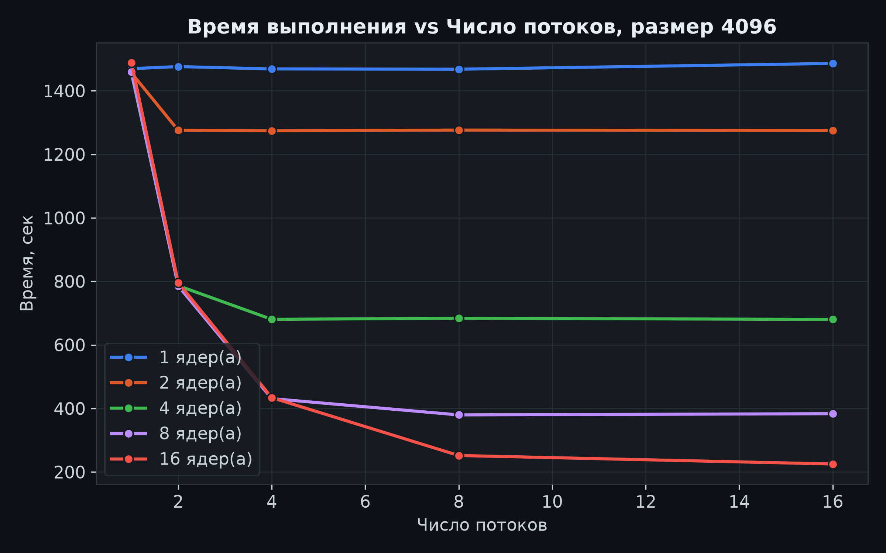
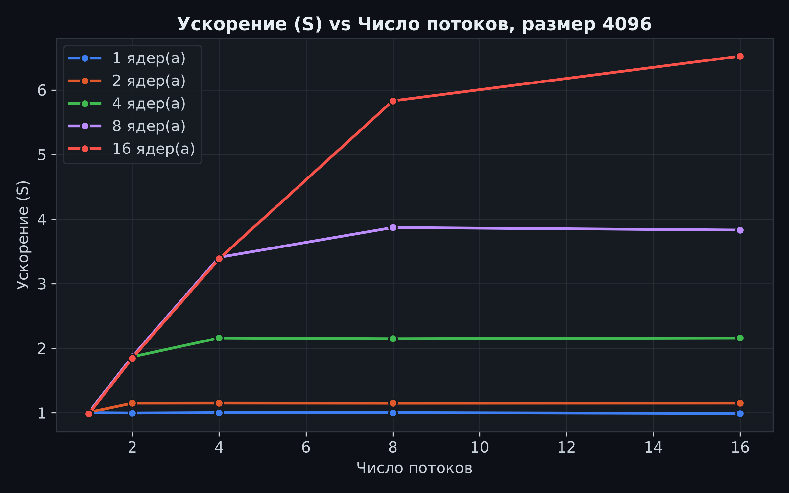
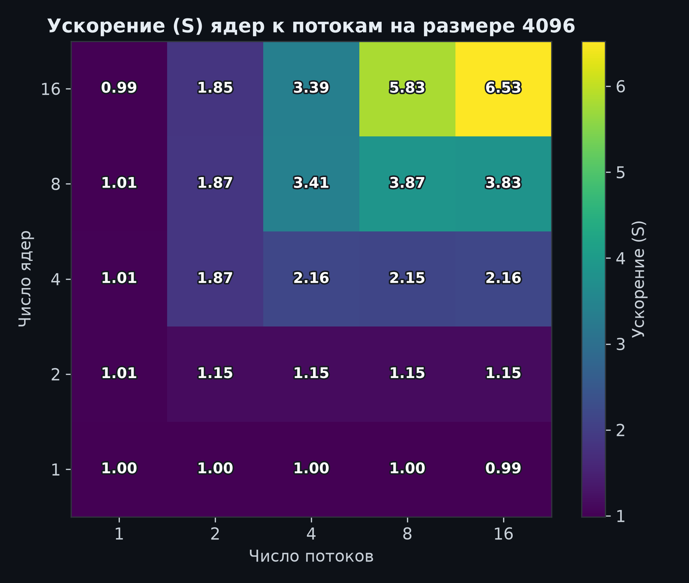
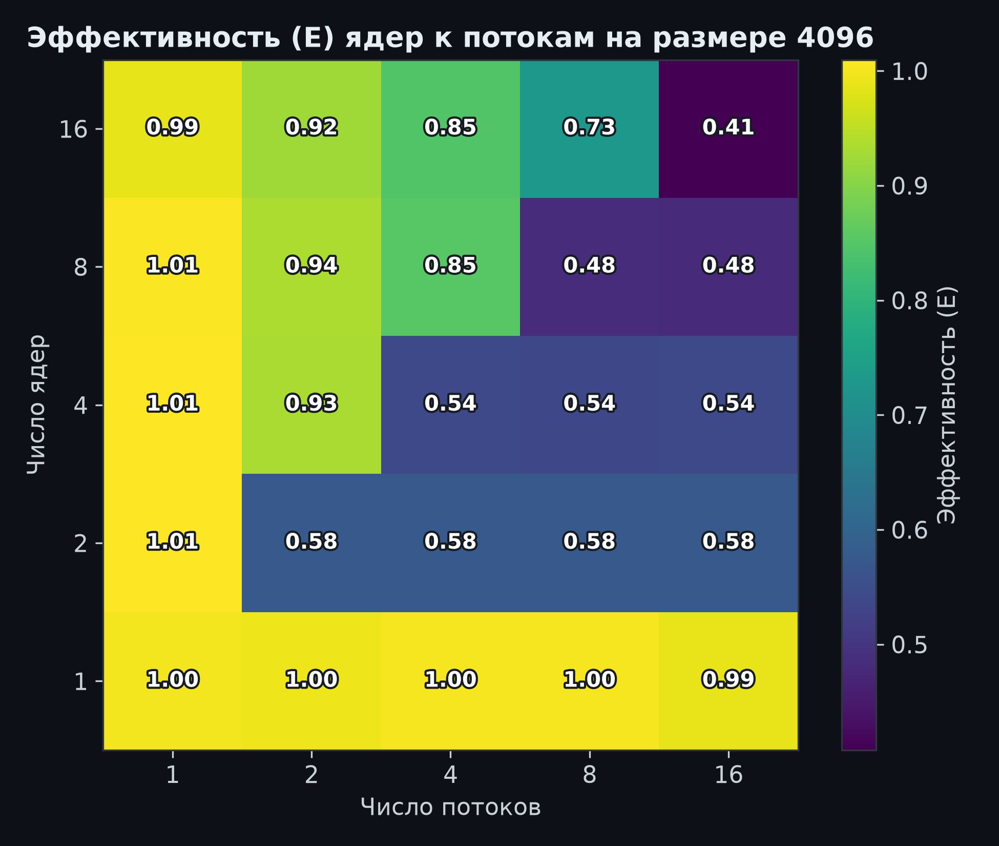
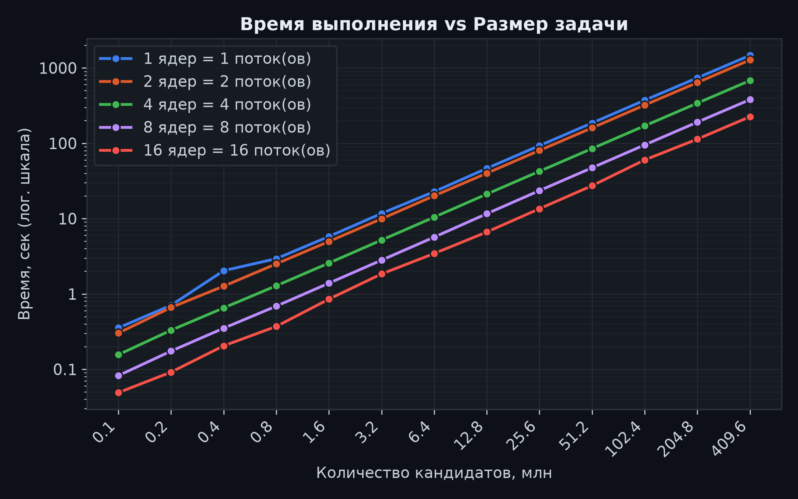

# Лабораторная работа 2 — параллельная версия на OpenMP

Архитектура, методика эксперимента, генерация данных, замер, верификация и агрегация описаны в [корневом README](../../README.md).

## 1. Цель работы

Задача — реализовать и измерить многопоточную версию программы для синтетического перебора хешей паролей с использованием OpenMP, проверить корректность результатов на сетке конфигураций «ядра × потоки» и оценить ускорение и эффективность распараллеливания относительно последовательной версии из лабораторной работы 1.

## 2. Алгоритм

OpenMP распараллеливает тот же перебор, что и последовательная версия. Диапазон кандидатов делится на смежные куски по числу потоков, и каждый поток обрабатывает свой кусок независимо:

```cpp
omp_set_dynamic(0);
omp_set_num_threads(requested_threads);
actual_threads = omp_get_max_threads();
chunks = split_range(range_begin, range_end, actual_threads);

stopwatch.start();
#pragma omp parallel num_threads(actual_threads)
{
    tid = omp_get_thread_num();
    per_thread_matches[tid] = scan_chunk(chunks[tid]);
}
time_seconds = stopwatch.elapsed_seconds();

matches = concat(per_thread_matches);
sort(matches by id);
```

С помощью `omp_set_dynamic(0)` отключается динамическое изменение количества потоков системой, а `omp_set_num_threads()` устанавливает желаемое количество потоков для следующих параллельных вычислений (например, для дальнейшей директивы `#pragma omp parallel`). `omp_get_max_threads()` возвращает фактическое максимальное количество потоков, которое будет выделено для следующей параллельной области.

`split_range` разбивает диапазон на смежные куски, отличающиеся не более чем на один кандидат, без пропусков и наложений.

Внутри `scan_chunk` каждый поток создаёт собственный `CandidateCounter` от начала своего куска и складывает совпадения в локальный вектор. При этом синхронизация внутри цикла не требуется.

```cpp
CandidateCounter counter(charset, password_length, chunk.begin);
for (index = chunk.begin; index < chunk.end; ++index)
{
    password = counter.password();
    hash = hash_password(salt, password, iterations);
    if (id = targets.find(hash))
    {
        local_matches.push_back({id, password, hash});
    }
    counter.advance();
}
```

После выхода из параллельной области локальные векторы объединяются и сортируются по `id`, поэтому структура итоговых результатов для анализа совпадает с последовательной версией.

Сложность алгоритма по-прежнему O(N), но работа распределяется по P потокам, поэтому на каждый поток приходится O(N/P). Также добавляются накладные расходы на разбиение диапазона и слияние локальных результатов — O(P + M), где M — число совпадений.

## 3. Результаты

Все прогоны выполнялись на том же ноутбуке, что и в лабораторной работе 1, — Lenovo IdeaPad 5 Pro 14ACN6 (8/16 GB) с операционной системой Arch Linux — и повторялись неоднократно, чтобы исключить аномальные выбросы.

Все 325 прогонов на сетке «размер × ядра × потоки» прошли верификацию: 16/16 совпадений с `expected.jsonl` в каждом прогоне.

Таблица 1 — Сетка «ядра × потоки» на максимальном размере 4096 (409,6 млн кандидатов), фактические результаты из `results/openmp/results.csv`:

| Ядра | Потоки | Время, сек | Ускорение S | Эффективность E |
| ---- | ------ | ---------- | ----------- | --------------- |
| 1    | 1      | 1469,741   | 1,00        | 1,00            |
| 1    | 2      | 1476,223   | 1,00        | 1,00            |
| 1    | 4      | 1468,824   | 1,00        | 1,00            |
| 1    | 8      | 1467,950   | 1,00        | 1,00            |
| 1    | 16     | 1486,134   | 0,99        | 0,99            |
| 2    | 1      | 1456,118   | 1,01        | 1,01            |
| 2    | 2      | 1275,643   | 1,15        | 0,58            |
| 2    | 4      | 1274,358   | 1,15        | 0,58            |
| 2    | 8      | 1276,385   | 1,15        | 0,58            |
| 2    | 16     | 1274,909   | 1,15        | 0,58            |
| 4    | 1      | 1455,524   | 1,01        | 1,01            |
| 4    | 2      | 786,450    | 1,87        | 0,93            |
| 4    | 4      | 680,651    | 2,16        | 0,54            |
| 4    | 8      | 683,987    | 2,15        | 0,54            |
| 4    | 16     | 680,316    | 2,16        | 0,54            |
| 8    | 1      | 1459,230   | 1,01        | 1,01            |
| 8    | 2      | 785,797    | 1,87        | 0,94            |
| 8    | 4      | 431,063    | 3,41        | 0,85            |
| 8    | 8      | 379,734    | 3,87        | 0,48            |
| 8    | 16     | 383,567    | 3,83        | 0,48            |
| 16   | 1      | 1488,449   | 0,99        | 0,99            |
| 16   | 2      | 795,952    | 1,85        | 0,92            |
| 16   | 4      | 434,032    | 3,39        | 0,85            |
| 16   | 8      | 251,986    | 5,83        | 0,73            |
| 16   | 16     | 225,245    | 6,53        | 0,41            |

Анализ по итогам сетки на размере 4096:

- лучшая конфигурация — 16 ядер × 16 потоков, 225,2 сек на 409,6 млн кандидатов (≈1,82 млн канд/сек), ускорение S = 6,53;
- на одном ядре ускорение не достигается ни при каком числе потоков (S ≈ 1,0), что закономерно;
- ускорение растёт, пока число потоков не достигает числа доступных логических процессоров: S(8, 8) = 3,87, S(8, 16) = 3,83 — лишние потоки только добавляют накладных расходов; максимум сетки — S(16, 16) = 6,53;
- формальная эффективность E = S / min(ядра, потоки) по мере роста конфигураций падает до 0,41–0,58 в насыщенных конфигурациях;
- масштабируемость по размеру сохраняется: на всех размерах конфигурации «ядра = потоки» дают стабильный выигрыш ≈3,9–4,3 раза для 8 = 8 и ≈6,2–7,0 раза для 16 = 16 относительно одного потока.

## 4. Анализ графиков

### Время выполнения от числа потоков


Рисунок 1 — Время выполнения vs Число потоков, размер 4096

За эталон принимается замер конфигурации «1 ядро, 1 поток», совпадающий с последовательной версией из лабораторной работы 1. Кривая «1 ядро» плоская и лежит на уровне ≈1470 с, то есть потоки на одном выделенном ядре ускорения не дают.

На графике видно, что с ростом количества ядер и потоков время выполнения сокращается вплоть до ≈6,5 раза (с ≈1470 сек до ≈225 сек). Кривые резко падают, пока число потоков не достигает числа доступных логических процессоров, а дальнейшее добавление потоков время уже не уменьшает.

### Ускорение


Рисунок 2 — Ускорение vs Число потоков, размер 4096

С помощью второго графика можно сравнить, во сколько раз растёт производительность при добавлении ядер и потоков степенями двойки:

- ≈1,15 для 2 ядер и 2 потоков;
- ≈2,16 для 4 ядер и 4 потоков;
- ≈3,87 для 8 ядер и 8 потоков;
- ≈6,53 для 16 ядер и 16 потоков.

Кривая «16 ядер» продолжает расти вплоть до 16 потоков, поскольку только при таком числе потоков задействуются все логические процессоры машины.

### Теплокарты ускорения и эффективности


Рисунок 3 — Ускорение S на сетке «ядра × потоки», размер 4096


Рисунок 4 — Эффективность E на сетке «ядра × потоки», размер 4096

Теплокарта ускорения демонстрирует рост по обеим осям вплоть до максимальной конфигурации, достигая максимума S = 6,53 в углу «16 ядер × 16 потоков».

Теплокарта эффективности показывает, что E ≈ 1,0 держится, пока число потоков не превышает число физически доступных исполнителей, и формально падает в максимальных конфигурациях.

Можно сделать вывод, что с увеличением числа вычислительных ядер производительность стабильно растёт, однако эффективность этого прироста оказывается ниже, чем можно было бы ожидать при идеальном линейном масштабировании.

### Масштабируемость по размеру задачи


Рисунок 5 — Время выполнения vs Размер задачи (ядра = потоки)

В логарифмической шкале линии конфигураций «ядра = потоки» параллельны: время остаётся линейно зависящим от N при любом числе потоков, а расстояние между линиями соответствует ускорению различных конфигураций.

## 5. Выводы

1. Параллельная реализация на OpenMP корректна и воспроизводима: все 325 прогонов сетки прошли верификацию, найдено 16/16 паролей, совпадающих с эталоном. Слияние локальных результатов и сортировка по `id` дают тот же ответ, что и последовательная версия.

2. Ускорение ограничено физическими ресурсами машины. Максимум S ≈ 6,53 достигается при 16 ядрах × 16 потоках. Для каждого числа ядер пиковая производительность наступает при числе потоков, равном числу доступных логических процессоров, а дальнейшее увеличение числа потоков бесполезно.

3. Само по себе распараллеливание задачи работает достаточно эффективно. Пока нагрузка ложится на физические ядра процессора, эффективность остаётся высокой (≈0,82–0,97). Однако при исчерпании лимита физических ядер и переходе на логические ядра (SMT-потоки) эффективность снижается, что приводит к её формальному падению до ≈0,41.

4. Лучшая достигнутая производительность — ≈1,82 млн канд/сек против ≈0,28 млн канд/сек у последовательной версии из лабораторной работы 1. Конфигурация 16 ядер × 16 потоков принимается за опорную точку для сравнения с MPI и CUDA в следующих лабораторных работах.
