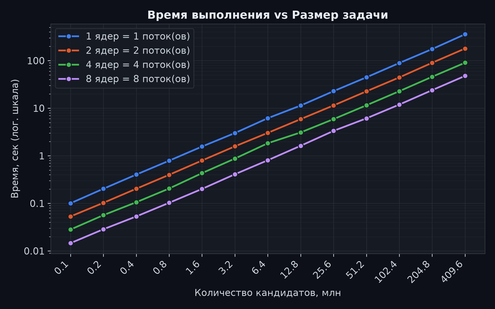

# Лабораторная работа 3 — параллельная версия на MPI

Архитектура, методика эксперимента, генерация данных, замер, верификация и агрегация описаны в [корневом README](../../README.md).

## 1. Цель работы

Задача — реализовать и измерить распределённую версию программы для синтетического перебора хешей паролей с использованием MPI, проверить корректность результатов на сетке конфигураций «размер задачи × число процессов» и оценить ускорение и эффективность распараллеливания относительно одного процесса. Эксперименты выполнены на вычислительном узле суперкомпьютера «Сергей Королёв».

## 2. Алгоритм

MPI распараллеливает тот же перебор, что и последовательная и OpenMP-версии. Диапазон кандидатов делится на смежные куски по числу процессов, и каждый ранг обрабатывает свой кусок независимо:

```cpp
MPI_Init; (rank, world_size);
chunks = split_range(range_begin, range_end, world_size);
my_chunk = chunks[rank];

MPI_Barrier();
stopwatch.start();
local_matches = scan_chunk(my_chunk);
local_time = stopwatch.elapsed_seconds();
max_time = MPI_Reduce(local_time, MPI_MAX, root=0);

if (rank == 0)
{
    for (src = 1; src < world_size; ++src)
    {
        count = MPI_Recv(src);
        buf = MPI_Recv(src);
        all_matches += unpack_matches(buf);
    }
    sort(all_matches by id);
    write result;
}
else
{
    MPI_Send(count);
    MPI_Send(buf);
}
```

Каждый ранг читает `config.json` и `targets.jsonl` самостоятельно: файлы маленькие, и на кластере с общей файловой системой перечитать их на каждом ранге дешевле, чем рассылать через `MPI_Bcast`.

`split_range` разбивает диапазон на смежные куски, отличающиеся не более чем на один кандидат, без пропусков и наложений, — та же общая функция, что и в OpenMP-версии.

`MPI_Barrier` перед секундомером выравнивает старт рангов: без него ранги, раньше дочитавшие конфигурацию, исказили бы сравнение времён между процессами.

Совпадения не-нулевых рангов пересылаются рангу 0 плоским байтовым буфером (запись фиксированной длины `id + password + hash`), без пользовательских MPI-типов. Ранг 0 собирает всё, сортирует по `id` и пишет результат, поэтому вывод совместим с последовательной и OpenMP-версиями.

Время выполнения — максимум по всем рангам (`MPI_Reduce` с `MPI_MAX`): реальная длительность параллельной задачи определяется самым медленным процессом, а не средним и не рангом 0.

Сложность алгоритма по-прежнему O(N), но работа распределяется по P процессам, поэтому на каждый приходится O(N/P). Также добавляются накладные расходы на пересылку локальных совпадений рангу 0 — O(P·M), где M — число совпадений, плюс синхронизация барьером при старте.

## 3. Условия эксперимента

- **Оборудование:** вычислительный узел суперкомпьютера «Сергей Королёв» — 2 × Intel Xeon X5647 @ 2.93 ГГц, CentOS 7.
- **Сборка:** Intel MPI (`intel/mpi5`), C++11; запуск через SLURM.
- **Сетка экспериментов:** 13 размеров задачи (коды 1…4096, число кандидатов = код × 100 000, то есть от 100 тыс. до 409,6 млн) × 4 значения числа процессов (1, 2, 4, 8). Итого **52 прогона**.
- Число процессов задавалось параметром `--ntasks-per-node`; все процессы размещались на одном узле.

Все 52 прогона прошли верификацию: 16/16 совпадений с `expected.jsonl` в каждом прогоне.

## 4. Результаты

Таблица 1 — Результаты на максимальном размере 4096 (409,6 млн кандидатов), из `results/mpi/results.csv`:

| Процессы | Время, сек | Ускорение S | Эффективность E |
| -------- | ---------- | ----------- | --------------- |
| 1        | 357,995    | 1,00        | 1,00            |
| 2        | 179,426    | 2,00        | 1,00            |
| 4        | 90,415     | 3,96        | 0,99            |
| 8        | 47,752     | 7,50        | 0,94            |

Анализ:

- лучшая конфигурация — 8 процессов: 47,8 сек на 409,6 млн кандидатов (≈8,58 млн канд/сек), ускорение S = 7,50 при эффективности E = 0,94;
- ускорение практически линейное на всём диапазоне процессов: S ≈ 2,0 на двух, ≈3,96 на четырёх, ≈7,50 на восьми; отклонение от идеала S = P не превышает 6 % даже на 8 процессах;

## 5. Анализ графика



В логарифмической шкале четыре линии строго параллельны на всём диапазоне от 0,1 до 409,6 млн кандидатов.
Это подтверждает две вещи:

1. Время линейно зависит от N при любом числе процессов (сложность O(N/P) сохраняется на любом масштабе), а постоянное вертикальное расстояние между линиями соответствует стабильному ускорению ≈2×, ≈4× и ≈7,5× независимо от размера задачи.
2. Отсутствие расхождения линий на больших N означает, что накладные расходы MPI не растут с объёмом работы.

## 6. Выводы

1. Распределённая реализация на MPI корректна и воспроизводима: все 52 прогона прошли верификацию, найдено 16/16 паролей, совпадающих с эталоном.

2. Ускорение практически линейное: S = 7,50 на 8 процессах при эффективности E = 0,94.

3. Ускорение не зависит от объёма задачи, а накладные расходы MPI не растут с ростом N.

4. Лучшая достигнутая производительность — ≈8,58 млн канд/сек против ≈0,275 млн канд/сек у последовательной версии из лабораторной работы 1. Конфигурация из 8 процессов принимается за опорную точку для сравнения с CUDA в следующей лабораторной работе.
