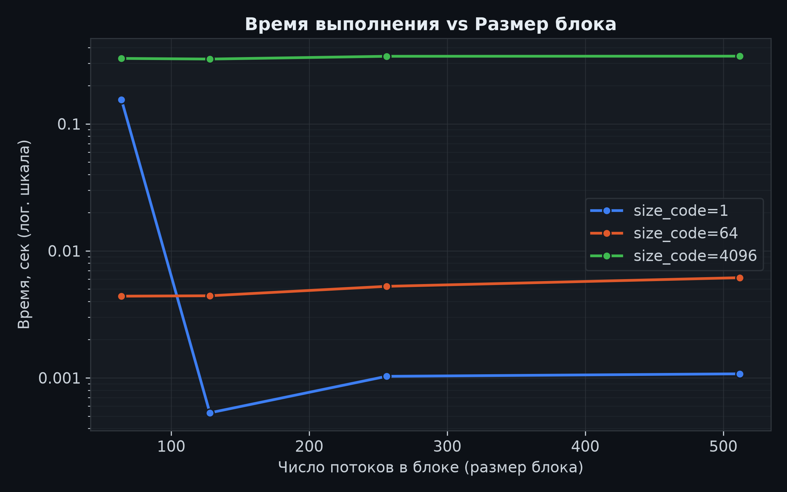
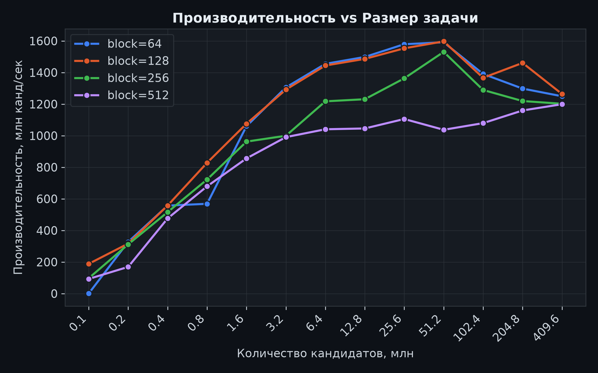
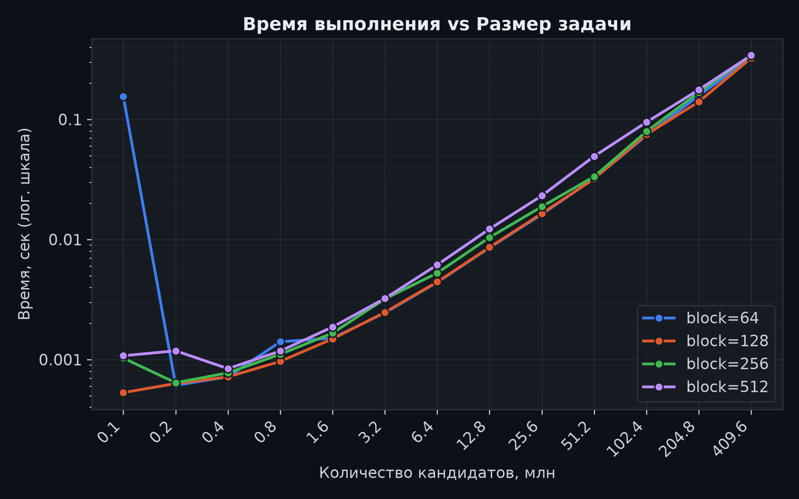

# Лабораторная работа 4 — параллельная версия на CUDA

Архитектура, методика эксперимента, генерация данных, замер, верификация и агрегация описаны в [корневом README](../../README.md).

## 1. Цель работы

Задача — модифицировать программу из лабораторной работы 1 для параллельной работы по технологии CUDA. Реализовать и измерить GPU-версию программы для синтетического перебора хешей паролей, проверить корректность результатов на всех размерах и оценить ускорение относительно последовательной версии и лучших конфигураций OpenMP и MPI.

## 2. Алгоритм

CUDA переносит весь перебор на GPU. Каждый поток видеокарты обрабатывает кандидатов в cycle с шагом, равным общему числу потоков, диапазон покрывается без разбиения на куски без синхронизации между потоками

```cpp
// host: запуск ядра
grid_size = min(65535, ceil(N / block_size));
audit_kernel<<<grid_size, block_size>>>(salt, targets, range_begin, range_end, ...);
cudaDeviceSynchronize();
```

```cpp
// device: один поток CUDA
__global__ void audit_kernel(...)
{
    for (index = blockIdx.x * blockDim.x + threadIdx.x;
         index < range_end;
         index += gridDim.x * blockDim.x)
    {
        password = index_to_password(index);
        digest = sha256_device(salt, password);
        for (t = 0; t < 16; ++t)
        {
            if (digest == targets[t])
            {
                pos = atomicAdd(&match_count, 1);
                matches[pos] = index;
            }
        }
    }
}
```

Размер сетки ограничен сверху 65535 блоками. Когда блоков не хватает на всех кандидатов, каждый поток обрабатывает несколько кандидатов с постоянным шагом `gridDim.x * blockDim.x`.

SHA-256 выполнен как `__device__`-функция, но без рекурсии, динамической памяти и ветвлений, а только регистры.

Целевые хэши хранятся в памяти устройства сразу в виде готовых дайджестов, поток сравнивает свой дайджест с 16 целями пословно, без преобразования в HEX-строку.

Совпадения фиксируются через `atomicAdd` по общему счётчику. Потоки находят цели одновременно и пишут свои индексы в общий массив без гонок. Ядро возвращает на хост только индексы найденных кандидатов, где уже восстанавливаются пароль и HEX-хэш и пишется результат в формате, совместимом с `verify_results.py` и `generate_plots.py`.

Размеры блока 64, 128, 256 и 512 потоков — варьируемый параметр заполненности SM: от него зависит, сколько блоков resident-потоков может одновременно держать мультипроцессор.

Секундомер охватывает запуск ядра и `cudaDeviceSynchronize`; чтение конфигурации, передача 16 хэшей и запись результата в замер не входят. Такая же методика замера была в лабораторной работе №1.

Сложность остаётся O(N) хэширований, но работа распределяется по потокам GPU. На каждый поток приходится O(N / (grid block)) кандидатов, плюс O(16) сравнений на кандидата и O(M) атомарных операций, где M — число совпадений.

## 3. Результаты

Прогоны выполнялись на ноутбуке ASUS TUF Gaming A15 FA507NV-LP025, так как в Lenovo IdeaPad 5 Pro 14ACN6 отсутствовала видеокарта NVIDIA, и повторялись неоднократно, чтобы исключить аномальные выбросы.

Все 52 прогона (13 размеров × 4 размера блока) прошли верификацию: 16/16 совпадений с `expected.jsonl` в каждом прогоне.

Таблица 1 — Сетка размеров блока на максимальном размере 4096 (409,6 млн кандидатов), фактические результаты из `results/cuda/results.csv`:

| Блок | Сетка | Потоков на GPU | Время, сек | Производительность, млн канд/сек | Ускорение S |
| ---- | ----- | -------------- | ---------- | -------------------------------- | ----------- |
| 64   | 65535 | 4 194 240      | 0,327763   | 1249,7                           | 4579        |
| 128  | 65535 | 8 388 480      | 0,324060   | 1264,0                           | 4631        |
| 256  | 65535 | 16 776 960     | 0,340733   | 1202,1                           | 4405        |
| 512  | 65535 | 33 553 920     | 0,341535   | 1199,3                           | 4394        |

Таблица 2 — Лучший размер блока (128) по всем размерам задачи, ускорение относительно последовательной версии из лабораторной работы 1:

| size_code | Кандидаты | Время, сек | Производительность, млн канд/сек | Ускорение S |
| --------- | --------- | ---------- | -------------------------------- | ----------- |
| 1         | 100 000   | 0,000530   | 188,6                            | 692         |
| 2         | 200 000   | 0,000632   | 316,6                            | 1157        |
| 4         | 400 000   | 0,000717   | 557,6                            | 2023        |
| 8         | 800 000   | 0,000966   | 828,3                            | 2984        |
| 16        | 1,6 млн   | 0,001487   | 1075,7                           | 3893        |
| 32        | 3,2 млн   | 0,002476   | 1292,2                           | 4684        |
| 64        | 6,4 млн   | 0,004431   | 1444,4                           | 5204        |
| 128       | 12,8 млн  | 0,008612   | 1486,3                           | 5347        |
| 256       | 25,6 млн  | 0,016483   | 1553,1                           | 5766        |
| 512       | 51,2 млн  | 0,032055   | 1597,2                           | 5874        |
| 1024      | 102,4 млн | 0,074933   | 1366,5                           | 5123        |
| 2048      | 204,8 млн | 0,140197   | 1460,8                           | 5398        |
| 4096      | 409,6 млн | 0,324060   | 1264,0                           | 4631        |

Анализ по итогам прогонов:

- лучшая конфигурация на размере 4096 — блок 128: 0,324 сек на 409,6 млн кандидатов (≈1,26 млрд канд/сек), ускорение ≈4630 раз относительно последовательной версии;
- размер блока слабо влияет на время при больших размерах. Разброс четырёх конфигураций на 4096 не превышает 6% (0,324–0,342 сек); блок 128 даёт лучшее или близкое к лучшему время на всех размерах начиная с 1,6 млн кандидатов;
- аномалия блока 64 на размере 1 (0,155 сек против 0,0005 сек у блока 128) — эффект прогрева контекста CUDA при первом запуске ядра; начиная с размера 2 блок 64 работает на уровне остальных конфигураций;
- производительность растёт с размером, пока время ядра превышает накладные расходы запуска: от ≈190 млн канд/сек на 0,1 млн до плато ≈1,45–1,60 млрд канд/сек на 6,4–204,8 млн; на 409,6 млн она снижается до ≈1,2–1,26 млрд канд/сек — при ограниченной сетке 65535 блоков ядро идёт примерно в 10 раз дольше, что согласуется со снижением частот GPU под длительной нагрузкой;
- GPU-версия превосходит лучшие CPU-конфигурации примерно на три порядка: ≈1,26 млрд канд/с против ≈1,82 млн канд/с у OpenMP (16 ядер × 16 потоков) и ≈1,62 млн канд/с у MPI (8 процессов).

## 4. Анализ графиков

### Время выполнения от размера блока


Рисунок 1 — Время выполнения vs Размер блока

Кривые для размеров 64 и 4096 практически плоские: как только сетка упирается в предел 65535 блоков, размер блока перестаёт быть решающим фактором, а лёгкий рост времени при переходе от 128 к 512 потокам объясняется меньшим числом блоков, которые SM может держать одновременно. Кривая размера 1 показывает выброс блока 64 (0,155 сек) — это прогрев контекста CUDA.

### Производительность от размера задачи


Рисунок 2 — Производительность vs Размер задачи

На малых размерах производительность ограничена накладными расходами запуска ядра: при времени порядка долей миллисекунды полезная работа занимает лишь часть замеренного интервала. Начиная с 6,4 млн кандидатов кривые выходят на плато ≈1,45–1,60 млрд канд/сек, после чего на 409,6 млн наблюдается умеренный спад. Блок 128 лидирует на больших размерах, а блок 512 устойчиво отстаёт начиная с 1,6 млн кандидатов.

### Время выполнения от размера задачи


Рисунок 3 — Время выполнения vs Размер задачи (лог. шкала)

В логарифмической шкале начиная с 0,8 млн кандидатов время растёт линейно по N для всех размеров блока, а на 409,6 млн кривые сходятся в коридор ≈6 %. Единственное качественное отклонение — выброс блока 64 на размере 0,1 млн, уже объяснённый прогревом контекста.

## 5. Выводы

1. Реализация на CUDA корректна и воспроизводима: все 52 прогона прошли верификацию, найдено 16/16 паролей, совпадающих с эталоном; восстановление паролей и хэшей на хосте по индексам из устройства даёт тот же ответ, что и последовательная версия.

2. Ускорение относительно последовательной версии составляет ≈4630 раз на размере 4096 (0,324 сек против 1500,8 сек), а относительно лучших CPU-конфигураций OpenMP и MPI ≈1000 раз.

3. Размер блока при больших размерах задачи не является критичным параметром (разброс ≤ 6 %); рекомендуемая конфигурация — блок 128 потоков при сетке, ограниченной 65535 блоками. Аномалии на минимальных размерах связаны с прогревом контекста CUDA и накладными расходами запуска, а не с алгоритмом.

4. Пиковая производительность ≈1,6 млрд канд/сек достигается на размерах 51,2–204,8 млн кандидатов; на 409,6 млн она снижается до ≈1,26 млрд канд/сек из-за снижения частот GPU при длительной нагрузке — аналог температурного троттлинга из лабораторной работы 1, но на видеокарте.

5. Конфигурация блок 128 / сетка 65535 принимается за опорную точку CUDA для итогового сравнения всех четырёх технологий параллелизма.
