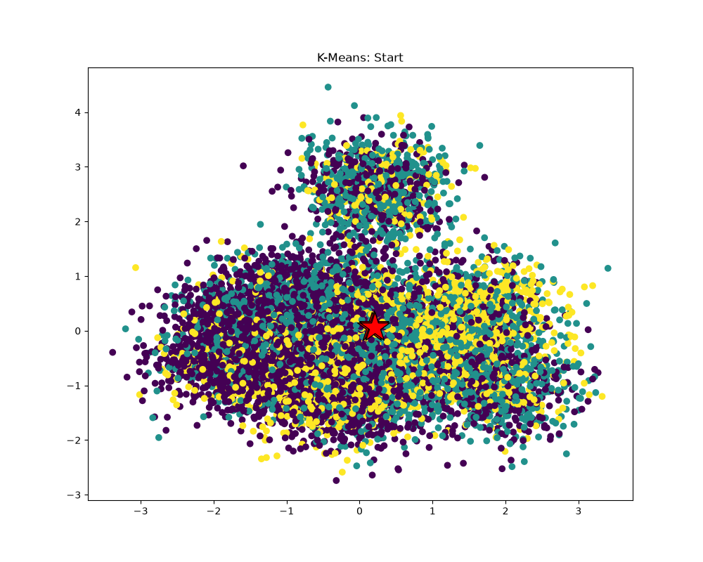
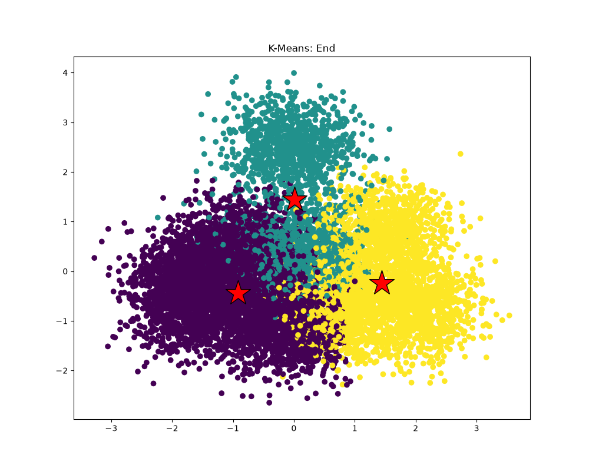
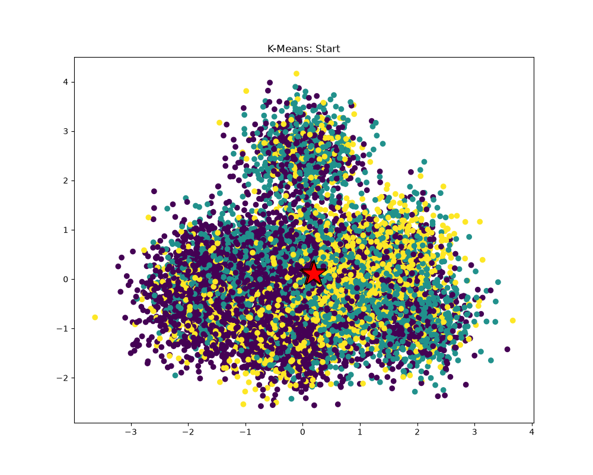
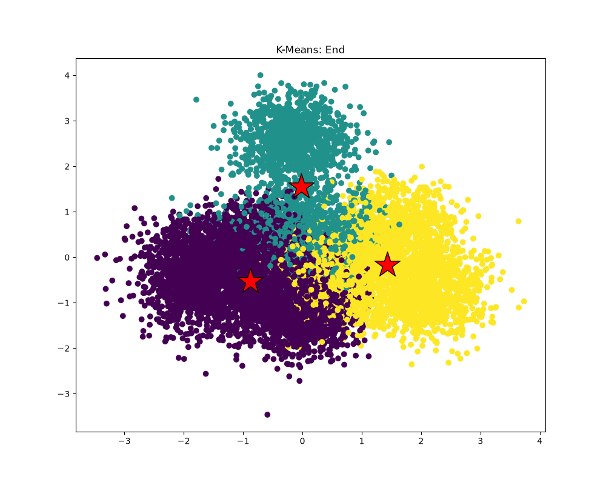

# Лабораторная работа 5 — параллельный K-Means (Stanford CS149 asst1, Program 6)

Задание: взять любую программу из репозитория [stanford-cs149/asst1](https://github.com/stanford-cs149/asst1) и выполнить её по пунктам соответствующего задания.

Выбрана программа **Program 6 «Making K-Means Faster»**: распараллелить ровно одну функцию многопоточной версии k-means, получить ускорение и оформить решение в формате задания «I measured … → X → I tried … → speedup».

## 1. Цель работы

Задача — профилировать многопоточную версию k-means (`kmeansThread.cpp`), выявить горячую функцию, распараллелить её без гонок данных, подтвердить совпадение результатов с оригиналом и достичь ускорения.

Ограничения: изменять можно только `kmeansThread.cpp`, распараллеливается ровно одна функция.

## 2. Алгоритм и ход работы

### Шаг 1. Измерение

Три функции тела главного цикла — `computeAssignments`, `computeCentroids`, `computeCost` — обёрнуты вызовами `CycleTimer::currentSeconds()`, время просуммировано по всем итерациям до сходимости. Реальные замеры на данных генератора (M=5000, N=100, растёт K):

| K   | computeAssignments | computeCentroids | computeCost |
| --- | ------------------ | ---------------- | ----------- |
| 3   | 68.2 %             | 12.1 %           | 19.7 %      |
| 16  | 91.7 %             | 3.1 %            | 5.2 %       |
| 32  | 95.4 %             | 1.8 %            | 2.9 %       |

На больших объёмах доля выполнения функции ещё выше: при M=100000, N=100, K=32 (54 итерации до сходимости) `computeAssignments` занимает суммарно 95.2%, `computeCentroids` — 2.2%, `computeCost` — 2.6%; при M=200000, K=64 доля достигает 97.1%.

### Шаг 2. Вывод

`computeAssignments` — безусловная та функция, которая нам нужна, это можно понять и из анализа сложности функции. У неё O(K·M·N) (для каждой из M точек — расстояние до каждого из K центроидов), тогда как `computeCentroids` и `computeCost` — O(M·N); множитель K и делает её доминирующей. Значит, распараллеливать нужно именно её.

### Шаг 3. Что попробовал

Каждый поток берёт непересекающийся диапазон `m = [start, end)` и для каждой своей точки сам перебирает все K центроидов, выбирая ближайший. При такой схеме:

- `minDist` становится локальным скаляром потока — общего массива нет;
- каждый поток пишет только в свои ячейки `clusterAssignments` — гонок нет по построению, синхронизация не нужна вообще;
- M (~10^6) делится на любое число потоков с идеальной балансировкой (остаток раздаётся по одной точке первым потокам).

```cpp
// диапазон точек [start, end) закреплён за потоком
for (int m = start; m < end; ++m)
{
    float minDist = std::numeric_limits<float>::max();
    for (int k = 0; k < K; ++k)
    {
        float d = dist(points[m], centroids[k]);
        if (d < minDist)
        {
            minDist = d;
            clusterAssignments[m] = k;
        }
    }
}
```

Порядок перебора `k = 0..K-1` со строгим `<` сохранён из оригинала, поэтому совпадают и результат, и правило разрешения ничьих. Число потоков — `std::thread::hardware_concurrency()`. Объём правок около 25 строк.

### Шаг 4. Корректность

- Собраны оригинал и параллельная версия, прогнаны на одних данных. Расхождения в `clusterAssignments` отсутствуют.
- `python3 plot.py` даёт осмысленную картину сходимости

## 3. Результаты

Замеры выполнялись на ноутбуке Lenovo IdeaPad 5 Pro 14ACN6 (8/16 GB) с операционной системой Arch Linux — и повторялись неоднократно, чтобы исключить аномальные выбросы.

| Версия       | [Total Time], ms | Ускорение |
| ------------ | ---------------- | --------- |
| Оригинал     | 95900.688        | 1.00×     |
| Параллельная | 32992.190        | **2.91×** |

## 4. Анализ графиков


Рисунок 1 — K-Means: Start, оригинальная версия


Рисунок 2 — K-Means: End, оригинальная версия


Рисунок 3 — K-Means: Start, параллельная версия


Рисунок 4 — K-Means: End, параллельная версия

На старте три начальных центроида находятся практически в одной точке в центре облака данных, поэтому начальная раскраска точек по ближайшему центроиду выглядит «перемешанной». После сходимости каждый центроид сместился в центр своего скопления, а точки разбились на три плотных кластера с небольшим перекрытием на границах. Пары рисунков оригинальной и параллельной версий воспроизводят одну и ту же структуру кластеров — визуальное подтверждение совпадения результатов.

## 5. Выводы

1. Профилирование выявило самую долгую функцию — `computeAssignments` (>90% времени при K ≥ 16, до 97.1% на крупных K), именно она и была распараллелена.

2. Разбиение работы по точкам, а не по центроидам, устранило гонки данных без какой-либо синхронизации.

3. Корректность подтверждена, графики `start.png`/`end.png` обеих версий совпадают по структуре кластеров.

4. Получено ускорение в ≈3 раза
